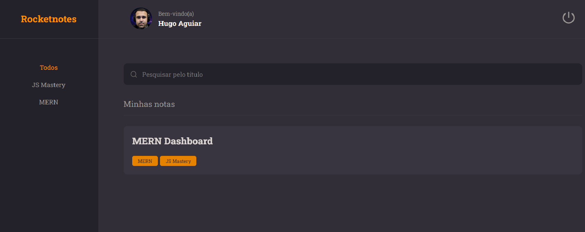
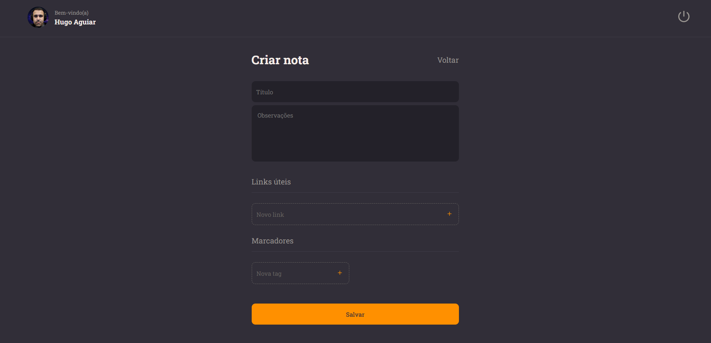
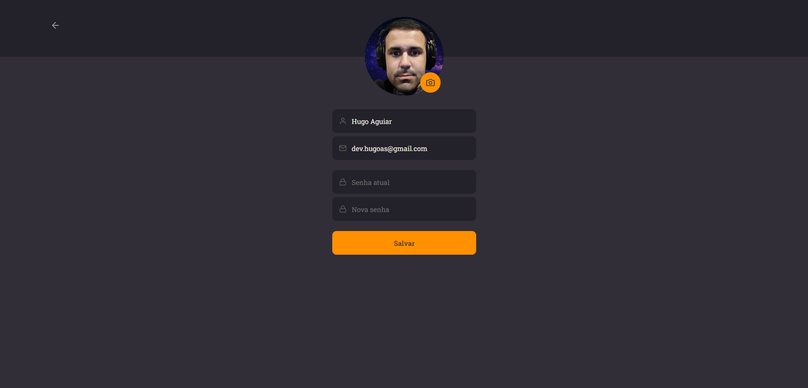

<h1 align="center"> Rocket Notesq</h1>

## 💻 Projeto
Projeto desenvolvido durante os Stages 8, 9 e 10 do programa Explorer da Rocketseat.

Uma aplicação para criação de notas contendo links úteis                
você utiliza no seu dia a dia.

A aplicação possui um sistema de cadastro/login e também com um perfil  pessoal no qual você pode alterar seus dados e até inserir um avatar

Para acessar o projeto [Clique Aqui!](https://rocketnotes-web.vercel.app/)

    
    
     
    
     
  

## 🚀 Tecnologias
Esse projeto foi desenvolvido com as seguintes tecnologias: 
HTML  
CSS / Styled Components  
JavaScript 
React 
Vite 
NodeJs 
Express 
Bcryptjs 
Cors 
Sqlite 
Knex
                                                           
